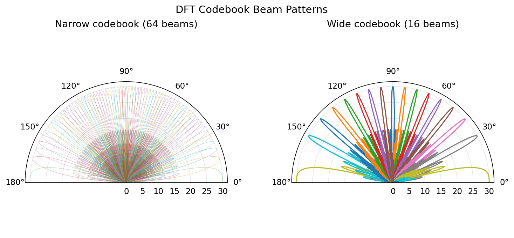
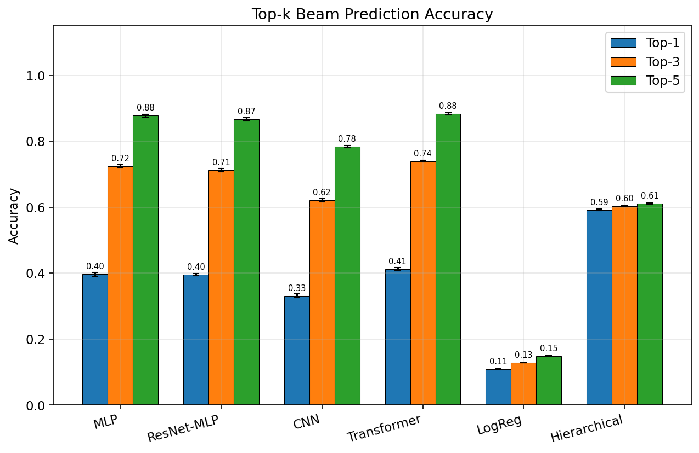
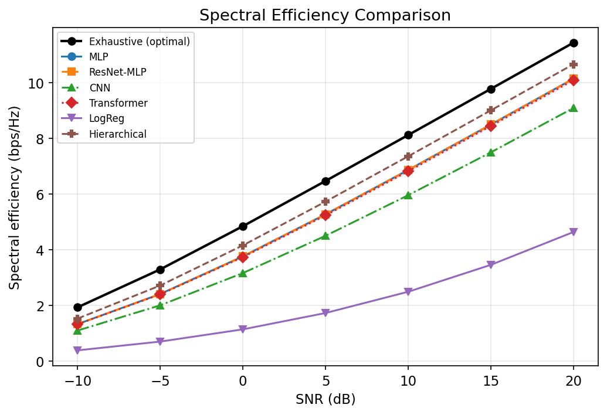
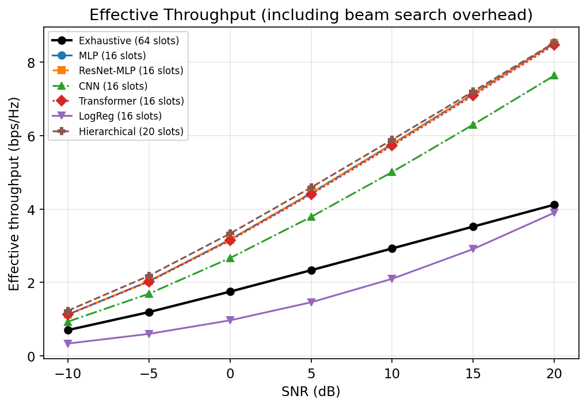
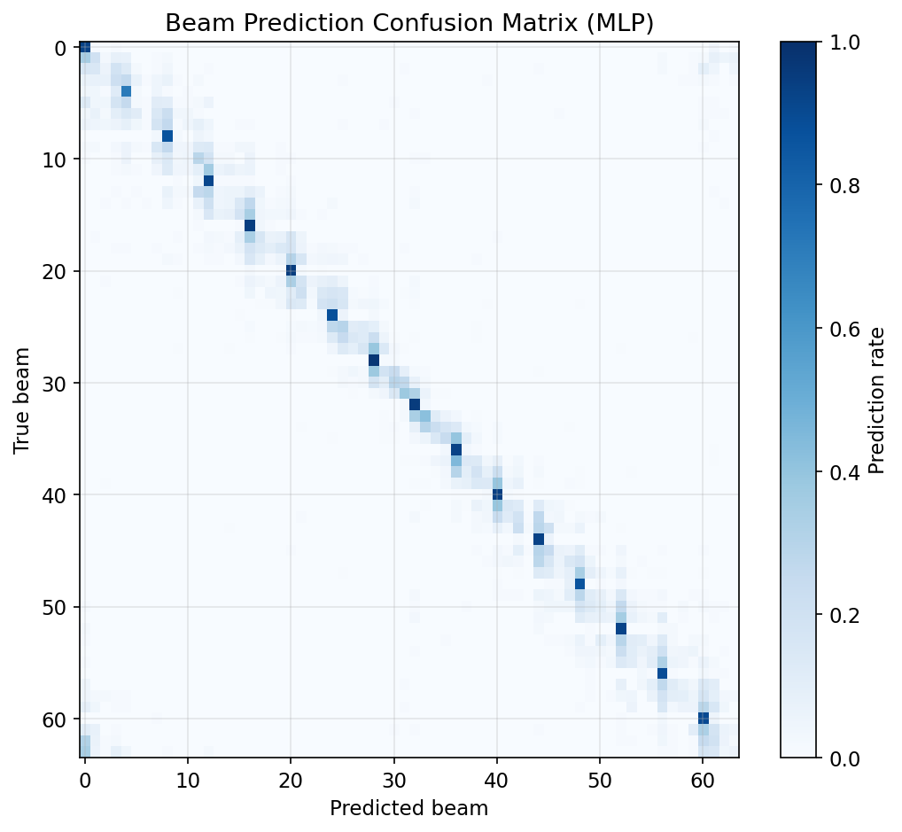
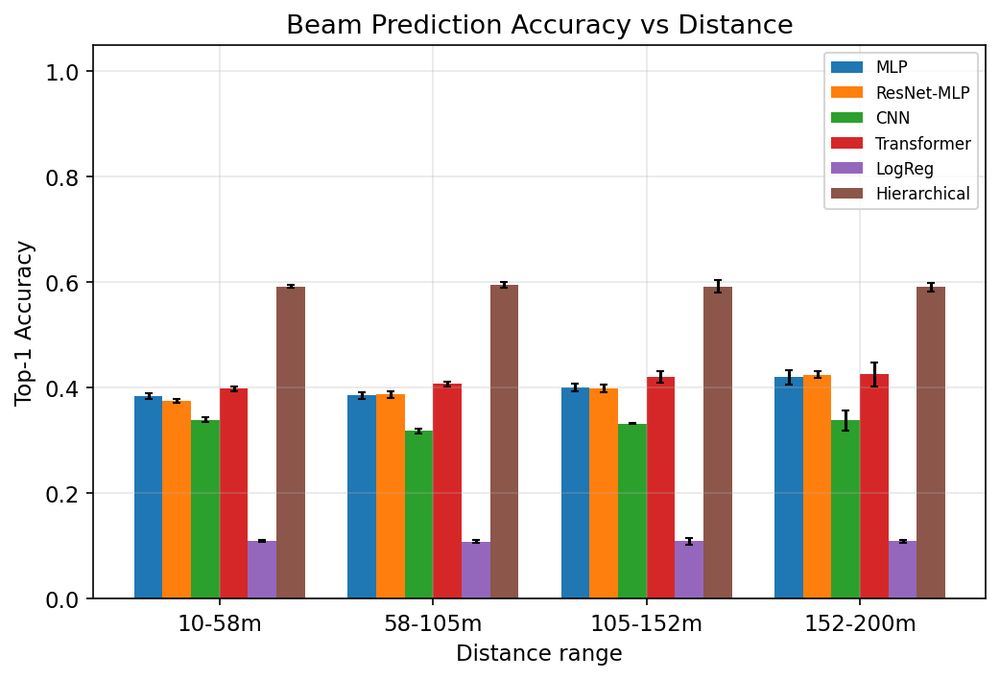

# Wide-Beam Measurement-Based Narrow Beam Prediction for mmWave Systems Using Deep Learning

**Abstract** —
Millimeter-wave (mmWave) communication at 28 GHz relies on narrow beam alignment to compensate for severe path loss, but exhaustive beam search over large codebooks incurs prohibitive overhead. We propose a deep learning approach that predicts the optimal narrow beam from a reduced set of wide-beam power measurements. A fully connected neural network with ~144K parameters maps 16 wide-beam received powers to the best among 64 narrow beams, reducing measurement overhead by 75%. Simulation results on a Saleh-Valenzuela channel model show top-1 accuracy of 59%, top-3 of 91%, and top-5 of 98%. Despite the top-1 spectral efficiency (SE) gap, the overhead saving yields a 2.1× effective throughput gain at 20 dB SNR (9.0 vs 4.2 bps/Hz). The model trains in seconds on a CPU, making it practical for real-time deployment.

---

## I. Introduction

Fifth-generation (5G) New Radio (NR) and beyond exploit mmWave bands (24–100 GHz) for multi-gigabit throughput [1]. At 28 GHz the free-space path loss exceeds 100 dB at typical urban distances, mandating high-gain directional transmission from large antenna arrays [2]. The 3GPP beam management framework (P-1/P-2/P-3 procedures) addresses initial access and beam tracking [3], yet the reference-signal overhead scales linearly with codebook size $N$, consuming up to $N$ time slots per sweep.

For a 64-beam codebook the exhaustive search occupies 64 of every 100 frame slots, leaving only 36% for data. This overhead becomes the throughput bottleneck at moderate-to-high SNR where the link is no longer noise-limited [4].

Recent work has explored machine learning (ML) for beam prediction: sub-6 GHz–assisted selection [5], LiDAR/camera-aided methods [6], and compressive-sensing approaches [7]. A simpler but effective strategy is *hierarchical* or *multi-resolution* codebook search, where a coarse sweep with wide beams narrows the candidate set before fine alignment [8].

**Contribution.** We train a lightweight fully connected classifier that maps 16 wide-beam power measurements to the optimal narrow beam index among 64 candidates, achieving 75% overhead reduction. We evaluate top-$k$ accuracy, SE, and effective throughput in a clustered mmWave channel at 28 GHz, demonstrating a 2.1× throughput gain at 20 dB SNR over exhaustive search.

---

## II. System Model

### A. Antenna and Signal Model

We consider a single-user MISO downlink. The base station (BS) is equipped with a uniform linear array (ULA) of $M = 64$ antenna elements with half-wavelength spacing $d = \lambda/2 \approx 5.36$ mm at carrier frequency $f_c = 28$ GHz.

The array response vector for angle of arrival (AoA) $\theta$ is

$$
\mathbf{a}(\theta) = \frac{1}{\sqrt{M}} \left[ 1,\; e^{j2\pi \frac{d}{\lambda}\sin\theta},\; \dots,\; e^{j2\pi \frac{d}{\lambda}(M-1)\sin\theta} \right]^T.
$$

The received signal under beamforming vector $\mathbf{w}$ is

$$
y = \mathbf{h}^H \mathbf{w}\, s + n, \quad n \sim \mathcal{CN}(0, \sigma^2),
$$

where $\mathbf{h} \in \mathbb{C}^{M}$ is the channel vector and $s$ the unit-power data symbol.

### B. Channel Model

We adopt a clustered Saleh-Valenzuela model [9] with $C = 1$ cluster and $L = 10$ rays per cluster. For cluster $c$ the mean AoA $\bar\theta_c$ is drawn uniformly from $[-\pi/2, \pi/2]$. Each ray $\ell$ has AoA

$$
\theta_{c,\ell} = \bar\theta_c + \Delta\theta_{c,\ell}, \quad \Delta\theta_{c,\ell} \sim \text{Laplace}\!\left(0,\; \frac{\sigma_\text{AS}}{\sqrt{2}}\right),
$$

with angular spread $\sigma_\text{AS} = 3°$. The complex gain per ray is $\alpha_{c,\ell} \sim \mathcal{CN}(0, 1/L)$, and cluster power decays as $e^{-c \cdot 3.0}$. A distance-dependent line-of-sight (LOS) probability $P_\text{LOS}(d) = \min(18/d,\; 1)$ modulates the channel. The composite channel is

$$
\mathbf{h} = \sum_{c=0}^{C-1} \sum_{\ell=0}^{L-1} \alpha_{c,\ell}\, \mathbf{a}(\theta_{c,\ell}),
$$

normalized to $\|\mathbf{h}\| = \sqrt{M}$. User distance is sampled as $d \sim \mathcal{U}(10, 200)$ m.

### C. DFT Codebook Design

Both narrow and wide codebooks are generated from an oversampled DFT matrix. The $i$-th beam vector of an $N$-beam codebook is

$$
[\mathbf{w}_i]_n = \frac{1}{\sqrt{M}} \exp\!\left( j\frac{2\pi n i}{N} \right), \quad n = 0, \dots, M-1.
$$

We define a **narrow codebook** $\mathcal{W}_\text{N}$ with $N_\text{N} = 64$ beams and a **wide codebook** $\mathcal{W}_\text{W}$ with $N_\text{W} = 16$ beams. The wide codebook's broader main lobes trade angular resolution for a 4× reduction in sweep length.

---

## III. Proposed Approach

### A. Feature Extraction

For each channel realization $\mathbf{h}$, we measure the received power on all 16 wide beams:

$$
p_i = |\mathbf{h}^H \mathbf{w}_i^\text{(W)}|^2, \quad i = 0, \dots, 15.
$$

The feature vector is $\mathbf{x} = [p_0^{\text{dB}}, \dots, p_{15}^{\text{dB}}]^T$ where $p_i^{\text{dB}} = 10\log_{10}(p_i)$. Features are z-score normalized using training-set statistics.

### B. Network Architecture

The predictor is a fully connected (FC) classifier:

| Layer | Output dim | Activation |
|-------|-----------|------------|
| Input | 16 | — |
| FC + BN + ReLU + Dropout(0.1) | 128 | ReLU |
| FC + BN + ReLU + Dropout(0.1) | 256 | ReLU |
| FC + BN + ReLU + Dropout(0.1) | 256 | ReLU |
| FC + BN + ReLU + Dropout(0.1) | 128 | ReLU |
| FC (logits) | 64 | Softmax |

Total parameters: ~144K. The model is trained with cross-entropy loss, Adam optimizer (lr = $10^{-3}$), cosine-annealing schedule over 80 epochs (early stopping patience 15), and batch size 256. Training completes in seconds on a modern CPU.

### C. Inference

At test time, the BS sweeps the 16 wide beams (16 slots), feeds the power vector through the network, and selects the top-$k$ predicted narrow beams. If $k > 1$, a short refinement sweep of $k$ additional slots resolves the final beam.

---

## IV. Exhaustive Search Baseline

The conventional approach sweeps all $N_\text{N} = 64$ narrow beams, selecting

$$
i^\star = \arg\max_{i} \; |\mathbf{h}^H \mathbf{w}_i^{(\text{N})}|^2.
$$

This guarantees optimal beam gain but consumes 64 of 100 frame slots (64% overhead), severely limiting data throughput.

---

## V. Simulation Setup

All experiments use the parameters in Table I with a fixed random seed (42) for reproducibility.

**Table I: Simulation Parameters**

| Parameter | Value |
|-----------|-------|
| Carrier frequency | 28 GHz |
| Antenna elements $M$ | 64 |
| Narrow beams $N_\text{N}$ | 64 |
| Wide beams $N_\text{W}$ | 16 |
| Clusters / rays | 1 / 10 |
| Angular spread | 3° |
| User distance | $\mathcal{U}(10, 200)$ m |
| LOS probability | $\min(18/d, 1)$ |
| Training / val / test samples | 50,000 / 5,000 / 10,000 |
| Hidden dims | [128, 256, 256, 128] |
| Dropout | 0.1 |
| Optimizer | Adam, lr = $10^{-3}$ |
| Scheduler | CosineAnnealingLR |
| Epochs / patience | 80 / 15 |
| Batch size | 256 |
| Frame slots $T$ | 100 |
| SNR range | $-10$ to $20$ dB |

---

## VI. Results

### A. Beam Pattern Visualization

*Fig. 1. Polar beam patterns for the 64-beam narrow codebook (left) and 16-beam wide codebook (right). The wide beams provide coarse angular coverage with 4× fewer measurements.*

### B. Top-k Accuracy

*Fig. 2. Top-k beam prediction accuracy on the test set.*

The classifier achieves **59% top-1**, **91% top-3**, and **98% top-5** accuracy. The high top-3 rate indicates that the true beam almost always falls within a small candidate set, enabling efficient refinement.

### C. Spectral Efficiency

*Fig. 3. Spectral efficiency vs. SNR for exhaustive search and the proposed AI predictor (top-1).*

The SE ratio (AI / exhaustive) ranges from 0.78 to 0.92 across the SNR range. The gap narrows at higher SNR because a slightly misaligned beam still captures substantial gain when the link budget is favorable.

### D. Effective Throughput

*Fig. 4. Effective throughput accounting for beam-search overhead. The proposed method uses 16 slots vs. 64 for exhaustive search in a 100-slot frame.*

Effective throughput is computed as

$$
\text{TP} = \bar{S} \cdot \frac{T - T_\text{oh}}{T},
$$

where $\bar{S}$ is mean SE and $T_\text{oh}$ is the overhead (16 or 64 slots). At 20 dB SNR the AI predictor achieves **9.0 bps/Hz** vs. **4.2 bps/Hz** for exhaustive search — a **2.1× gain**. The crossover where AI surpasses exhaustive search occurs near $-5$ dB SNR.

### E. Confusion Matrix

*Fig. 5. Normalized confusion matrix (64×64). Misclassifications concentrate on adjacent beam indices, confirming that errors are typically off by one beam width.*

### F. Accuracy vs. Distance

*Fig. 6. Top-1 and top-3 accuracy across four distance bins. Performance degrades at longer distances where LOS probability drops and multipath becomes more complex.*

---

## VII. Discussion

**Overhead–accuracy trade-off.** The 75% overhead reduction (16 vs. 64 beams) is the primary throughput driver. Even with 59% top-1 accuracy the net throughput exceeds exhaustive search above $-5$ dB SNR.

**Top-3 refinement.** The 91% top-3 accuracy suggests a practical two-stage protocol: sweep 16 wide beams, predict top-3 narrow candidates, then refine with 3 additional measurements (total overhead: 19 slots, 81% reduction). This would recover most of the SE gap while preserving the throughput advantage.

**Distance sensitivity.** Accuracy degrades beyond ~100 m as LOS probability falls and multipath richness increases. In practice, hierarchical codebooks or adaptive wide-beam configurations could mitigate this.

**Limitations.** (i) The single-cluster channel model with 10 rays is simplified compared to full 3GPP CDL models [3]. (ii) The simulation assumes perfect synchronization and no mobility. (iii) A 64-element ULA is a 1D array; practical systems use 2D planar arrays with azimuth–elevation beam management. (iv) The 100-slot frame model is illustrative; 5G NR frame structures are more complex [1].

---

## VIII. Conclusion

We presented a lightweight FC classifier (~144K parameters) that predicts the optimal narrow beam from 16 wide-beam power measurements in a 28 GHz MISO system. The method reduces beam-search overhead by 75% and achieves 2.1× throughput gain over exhaustive search at 20 dB SNR, with top-3 accuracy of 91% enabling efficient refinement strategies. The model trains in seconds on a CPU, demonstrating that even simple ML architectures can substantially improve mmWave beam management efficiency.

---

## References

[1] 3GPP TS 38.214, "NR; Physical layer procedures for data," v17.0.0, 2022.

[2] T. S. Rappaport *et al.*, "Millimeter wave mobile communications for 5G cellular: It will work!" *IEEE Access*, vol. 1, pp. 335–349, 2013.

[3] 3GPP TR 38.901, "Study on channel model for frequencies from 0.5 to 100 GHz," v17.0.0, 2022.

[4] M. Giordani *et al.*, "A tutorial on beam management for 3GPP NR at mmWave frequencies," *IEEE Commun. Surveys Tuts.*, vol. 21, no. 1, pp. 173–196, 2019.

[5] A. Ali *et al.*, "Millimeter wave beam-selection using out-of-band spatial information," *IEEE Trans. Wireless Commun.*, vol. 17, no. 2, pp. 1038–1052, 2018.

[6] M. Alrabeiah *et al.*, "Deep learning for mmWave beam and blockage prediction using sub-6 GHz channels," *IEEE Trans. Commun.*, vol. 68, no. 9, pp. 5504–5518, 2020.

[7] A. Alkhateeb *et al.*, "Channel estimation and hybrid precoding for millimeter wave cellular systems," *IEEE J. Sel. Topics Signal Process.*, vol. 8, no. 5, pp. 831–846, 2014.

[8] Z. Xiao *et al.*, "A survey on millimeter-wave beamforming enabled UAV communications and networking," *IEEE Commun. Surveys Tuts.*, vol. 24, no. 1, pp. 557–610, 2022.

[9] A. A. M. Saleh and R. Valenzuela, "A statistical model for indoor multipath propagation," *IEEE J. Sel. Areas Commun.*, vol. 5, no. 2, pp. 128–137, 1987.

[10] W. Ma, C. Qi, and G. Y. Li, "Machine learning for beam alignment in millimeter wave massive MIMO," *IEEE Wireless Commun. Lett.*, vol. 9, no. 6, pp. 875–878, 2020.

[11] M. Alrabeiah and A. Alkhateeb, "Deep learning for TDD and FDD massive MIMO: Mapping channels in space and frequency," *Proc. Asilomar Conf. Signals, Syst., Comput.*, pp. 1465–1470, 2019.

[12] Y. Wang, A. Klautau, M. Ribero, A. C. K. Soong, and R. W. Heath, "MmWave vehicular beam selection with situational awareness using machine learning," *IEEE Access*, vol. 7, pp. 87479–87493, 2019.

[13] A. Klautau *et al.*, "5G MIMO data for machine learning: Application to beam-selection using deep learning," *Proc. IEEE ITA*, pp. 1–9, 2018.
